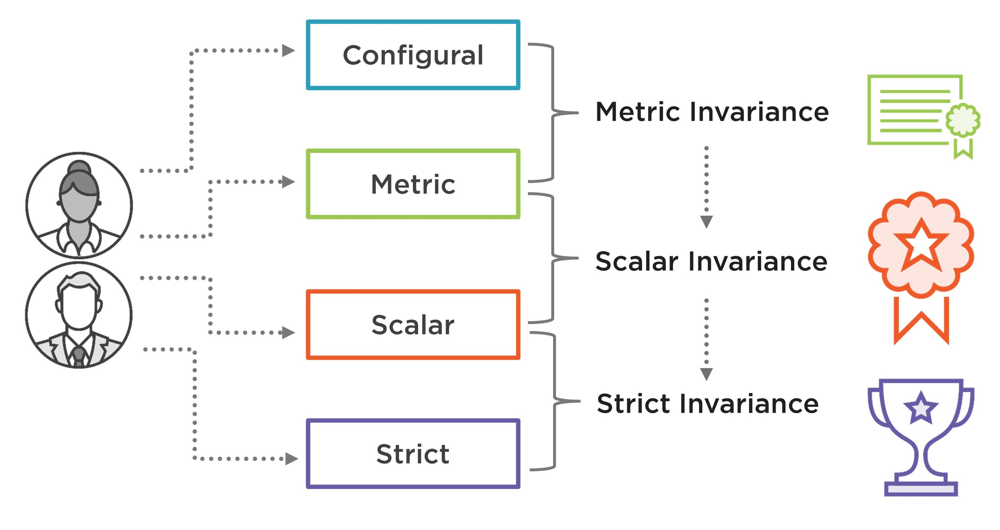
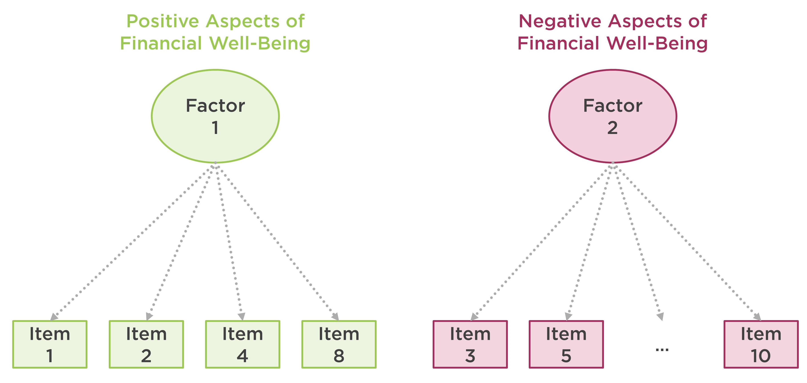

```{r setup, include=FALSE}
knitr::opts_chunk$set(echo = TRUE, eval = TRUE, warning = FALSE, message = FALSE)
library("rmarkdown")
```

### What is measurement invariance?

This post has been inspired by @van2012checklist's checklist for testing for measurement invariance.

* **Configural invariance model:** xxx
* **Scalar invariance model:** xxx
* **Metric invariance model:** xxx
* **Strict invariance model:** xxx





To demonstrate the test of measurement invariance, I am using the [Consumer Financial Protection Bureau](https://www.consumerfinance.gov/)'s [Financial Well-Being Scale](https://www.consumerfinance.gov/consumer-tools/financial-well-being/). 


XXX





For this demonstration, I have already cleaned up [the original data set](https://raw.githubusercontent.com/okanbulut/blog/master/data_and_codes/NFWBS_PUF_2016_data.csv) and saved it as **finance.csv** (you can see the codes for data cleaning [here](https://raw.githubusercontent.com/okanbulut/blog/master/data_and_codes/data_preparation.R)). The cleaned data set is available [here](https://raw.githubusercontent.com/okanbulut/blog/master/data_and_codes/finance.csv).


```{r, echo=TRUE, eval=TRUE}
finance <- read.csv("finance.csv", header = TRUE)
```

The following table shows the finance data set:

```{r, echo=FALSE}
paged_table(finance, options = list(cols.print = 11))
```


Before we begin the measurement invariance analysis, let's active the packages that we will use in the example. We will use `dplyr` [@dplyr] for organizing data, `corrplot` [@corrplot2017] for visualizing the correlation matrix of items, `lavaan` [@lavaan] to estimate multi-group confirmatory factor analysis models, and `semTools` [@semtools] to run model comparison tests.  


```{r, echo=TRUE, eval=TRUE}
library("dplyr")
library("corrplot")
library("lavaan")
library("semTools")
```

Now we will visualize the correlations among the items using the **corrplot** function. This is a preliminary analysis to check whether the items in the Financial Well-Being Scale are associated with each other. In the plot, 

```{r, echo=TRUE, eval=TRUE, fig.cap="Correlations among the items"}
# Correlation matrix of items
cormat <- finance %>%
  select(starts_with("item")) %>%
  cor()

# Correlation matrix plot
corrplot.mixed(cormat)
```

Let's see how the items could be grouped together. 


```{r, echo=TRUE, eval=TRUE}
corrplot(cormat, order = "hclust", addrect = 2)
```


```{r, echo=TRUE, eval=TRUE}
# Two-factor CFA model
model <- 'positive =~ item1 + item2 + item4 + item8
          negative =~ item3 + item5 + item6 + item7 + item9 + item10
          positive ~~ negative'
```

### Metric Invariance


```{r, echo=TRUE, eval=TRUE}
# Configural model
cfa.config <- cfa(model, data = finance, estimator = "WLSMV", std.lv = TRUE,
                  group = "gender")

# Metric model
cfa.metric <- cfa(model, data = finance, estimator = "WLSMV", std.lv = TRUE,
                  group = "gender", group.equal = "loadings")

# Model comparison
compareFit(cfa.config, cfa.metric)
```

### Scalar Invariance

Now we will check scalar invariance. 

```{r, echo=TRUE, eval=TRUE}
# Scalar model
cfa.scalar <- cfa(model, data = finance, estimator = "WLSMV", std.lv = TRUE,
                  group = "gender", group.equal = c("loadings","intercepts"))

# Model comparison
compareFit(cfa.metric, cfa.scalar)
```

We will look for partial invariance. 


```{r, echo=TRUE, eval=FALSE}
lavTestScore(cfa.scalar)
```

```{r, echo=FALSE, eval=TRUE}
lavTestScore(cfa.scalar)$uni
```


xxxx


```{r, echo=TRUE, eval=FALSE}
parTable(cfa.scalar)
```


```{r, echo=FALSE, eval=TRUE}
paged_table(parTable(cfa.scalar)[,c(1:8, 11, 12)])
```


```{r, echo=TRUE, eval=TRUE}
# Adjust the model
cfa.scalar2 <- cfa(model, data = finance, estimator = "WLSMV", std.lv = TRUE,
                   group = "gender", group.equal = c("loadings","intercepts"), 
                   group.partial = c("item1 ~ 1", "item4 ~ 1", "item7 ~ 1"))

# Model comparison
compareFit(cfa.metric, cfa.scalar2)
```

### Strict Invariance

Finally, we will check strict invariance. 

```{r, echo=TRUE, eval=TRUE}
# Strict model
cfa.strict <- cfa(model, data = finance, estimator = "WLSMV", std.lv = TRUE,
                  group = "gender", group.equal = c("loadings","intercepts", "residuals"),
                  group.partial = c("item1 ~ 1", "item4 ~ 1", "item7 ~ 1"))


compareFit(cfa.scalar2, cfa.strict)
```


