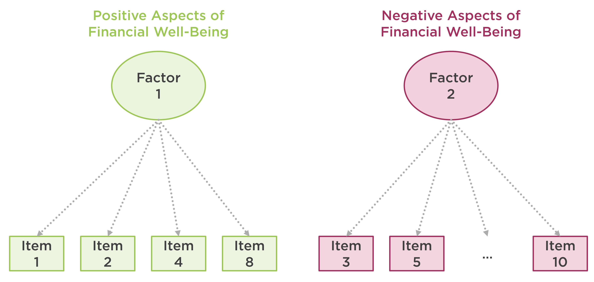

```{r setup, include=FALSE}
knitr::opts_chunk$set(echo = TRUE, eval = TRUE, warning = FALSE, message = FALSE)
library("rmarkdown")
library("kableExtra")
```

## Measurement Invariance

In the social sciences, researchers often use self-reported measurement instruments (e.g., scales, surveys, and questionnaires) to assess different latent constructs (e.g., emotions, attitudes, and preferences). Data collected through such instruments are typically used for comparing groups at a particular time point or comparing the same individuals across multiple time points. To be able to make valid group comparisons, researchers must ensure that the instrument measures the target latent construct(s) with the same factorial structure across groups. If the measurement instrument can sufficiently maintain its factorial structure across groups, it is called **measurement invariant (MI)**. The lack of measurement invariance (i.e., measurement non-variance) indicates that the latent constructs cannot be measured and interpreted in the same way across groups. 

For example, a researcher could design a new questionnaire to measure attitudes toward spirituality and administer the instrument to a sample of respondents in the target population. Depending on the quality of the items in the questionnaire, individuals from different ethnic and religious groups may perceive and interpret *spirituality* differently. Thus, individuals from a particular ethnic group might be less (or more) likely to endorse the items on the questionnaire. If this situation significantly affects individuals' response behaviors, then it is also very likely to influence the factorial structure of the questionnaire. If this is the case, the questionnaire is not measurement invariant and therefore group comparisons based on the results of the questionnaire will not be valid. 

This post has been inspired by @van2012checklist's checklist for testing for measurement invariance. The authors provide a nice description of measurement invariance along with Mplus syntax for all the analyses described in their paper. Similarly, in this post I will briefly describe the steps for testing measurement invariance and then demonstrate how to conduct measurement invariance analyses in R. To test for measurement invariance, we need to estimate and compare increasingly constrained confirmatory factor analysis (CFA) models with each other: 

* **Configural invariance model:** A multi-group CFA model fitted for each group separately, without any equality constraints. This model allows us to test whether the same factorial structure holds across all groups.
* **Metric invariance model:** A constrained version of the configural model where the factor loadings are assumed to be equal across groups but the intercepts are allowed to vary between groups.
* **Scalar invariance model:** A constrained version of the metric model where both the factor loadings and intercepts are assumed to be equal across groups. 
* **Strict invariance model:** A constrained version of the scalar model where the factor loadings, intercepts, and residual variances are fixed across groups. 


To evaluate the configural model for each group, we can use @hu1999cutoff's guidelines for model fit indices: (1) Comparative fit index (CFI) > .95; Tucker-Lewis index (TLI) > .95; and root mean square error of approximation (RMSEA) < .06. With sufficient model fit for configural invariance, we can proceed to metric invariance. 

To test metric invariance, we need to compare the configural model against the metric model using a chi-square difference ($\Delta\chi^2$) test. If the test is significant, then there is a lack of metric invariance and thus there is no need to test scalar and strict invariance. If, however, the test is **not** significant, then metric invariance is established and thus we can move to the next step, scalar invariance. 

To assess scalar invariance, we need to follow a similar approach by comparing the scalar model against the metric model. A statistically insignificant result for the $\Delta\chi^2$ test would indicate scalar invariance of the factorial model. @van2012checklist suggest that scalar invariance must hold to be able to interpret latent means and correlations across groups. If scalar invariance is not fully satisfied, then partial MI could be established by adjusting factor loadings and/or intercepts [@steenkamp1998assessing].

Finally, if either partial or full scalar variance holds, then we can test strict invariance by comparing the strict model with the scalar model. @van2012checklist notes that with the lack of strict invariance, groups can still be compared on the latent construct(s). Figure 1 shows a summary of the steps for testing different types of MI based on the four invariance models summarized above. 


## Example

To demonstrate the test of measurement invariance, I will be using the [Consumer Financial Protection Bureau (CFPB)](https://www.consumerfinance.gov/)'s Financial Well-Being Scale. CFPB defines financial well-being as follows:

> Financial well-being is a state of being wherein a person can fully meet current and
ongoing financial obligations, can feel secure in their financial future, and is able to
make choices that allow them to enjoy life.

To measure the construct of financial well-being, CFPB created [the Financial Well-Being Scale](https://www.consumerfinance.gov/consumer-tools/financial-well-being/) that consists of ten rating scale items. The items cover all four elements of the CFPB’s definition of financial well-being: control over finances, capacity to absorb a financial shock, being on track to meet financial goals, and having the financial freedom to enjoy life, using both positive and negative phrasing. Figure 2 shows a list of the items and their response options. 


CFPB's [technical report](https://files.consumerfinance.gov/f/documents/201705_cfpb_financial-well-being-scale-technical-report.pdf) on the Financial Well-Being Scale indicates that there are two latent dimensions (i.e., factors) associated with the polarity of the items (i.e., whether the items were phrased negatively or positively). Figure 3 demonstrates the factorial structure of the Financial Well-Being Scale. 





For this demonstration, I have already cleaned up [the original data set](https://raw.githubusercontent.com/okanbulut/blog/master/data_and_codes/NFWBS_PUF_2016_data.csv) and saved it as **finance.csv**. You can see the codes for data cleaning and preparation [here](https://raw.githubusercontent.com/okanbulut/blog/master/data_and_codes/data_preparation.R). Also, the cleaned data set (i.e., finance.csv) is available [here](https://raw.githubusercontent.com/okanbulut/blog/master/data_and_codes/finance.csv).


```{r, echo=TRUE, eval=TRUE}
finance <- read.csv("finance.csv", header = TRUE)
```

The following table shows the finance data set. There are 3,811 respondents (1701 female, 2110 male) who responded to the items in the scale. 

```{r, echo=FALSE}
paged_table(finance, options = list(cols.print = 11))
```


Before we begin the measurement invariance analysis, we need to active the R packages that we will utilize in the example. We will use `dplyr` [@dplyr] for organizing data, `corrplot` [@corrplot2017] for visualizing the correlation matrix of the items, `lavaan` [@lavaan] to estimate multi-group CFA models, and `semTools` [@semtools] to run model comparison tests.  


```{r, echo=TRUE, eval=TRUE}
library("dplyr")
library("corrplot")
library("lavaan")
library("semTools")
```

Now we can go ahead and visualize the correlations among the items using the **corrplot** function. This is a preliminary analysis to check whether the items in the Financial Well-Being Scale are associated with each other. We already know the factorial structure of the scale but this plot will show how strongly the items are associated with each other and whether there are two groups of items (one for positively-worded items and another for negatively-worded items). 

```{r, echo=TRUE, eval=TRUE}
# Correlation matrix of items
cormat <- finance %>%
  select(starts_with("item")) %>%
  cor()

# Correlation matrix plot
corrplot.mixed(cormat)
```

The plot shows that the items are moderately correlated with each other. Due to the polarity of the items, some of the correlations are negative (red), while the others are positive (blue). We can use *hierarchical clustering* to group the items together in the same plot. The next plot shows that positively-worded items (items 1, 2, 4, and 8) have been grouped together in the upper rectangle, while the remaining six items (i.e., negatively-worded items) have been grouped in the lower rectangle. 


```{r, echo=TRUE, eval=TRUE}
corrplot(cormat, order = "hclust", addrect = 2)
```

Next, using the `lavaan` package (see <https://lavaan.ugent.be/> for more information on the package), we will estimate a series of multi-group CFA models using gender as a group variable. For all of the models, the baseline model is the same: a two-factor model where the positively-worded items define one dimension and the negatively-worded items define another dimension. Therefore, we define **model** with two factors (positive and negative) and assume that the two factors are correlated with each other: **positive ~~ negative**


```{r, echo=TRUE, eval=TRUE}
# Two-factor CFA model
model <- 'positive =~ item1 + item2 + item4 + item8
          negative =~ item3 + item5 + item6 + item7 + item9 + item10
          positive ~~ negative'
```


### Configural Invariance

Our first invariance model is the configural invariance model. This is a multi-group CFA model separately estimated for male and female respondents in the finance data set. Since the items follow a 5-point rating scale, we will use the WLSMV estimator -- which is more suitable for categorical and ordinal data. We will also add **group = "gender"** to estimate the same CFA model for female and male respondents separately. 

```{r, echo=TRUE, eval=FALSE}
# Configural model
cfa.config <- cfa(model, data = finance, estimator = "WLSMV", group = "gender")

summary(cfa.config, fit.measures = TRUE, standardized = TRUE)
```

The following (partial) output shows the model fit indices. The results show that the fit indices from the configural model are aligned with @hu1999cutoff's guidelines for good model fit. 

```{r, echo=FALSE, eval=TRUE}
# Configural model
cfa.config <- cfa(model, data = finance, estimator = "WLSMV", group = "gender")
```

```{r, echo=TRUE, eval=FALSE}
User Model versus Baseline Model:

  Comparative Fit Index (CFI)                    0.997       0.959
  Tucker-Lewis Index (TLI)                       0.996       0.945
                                                                  
  Robust Comparative Fit Index (CFI)                            NA
  Robust Tucker-Lewis Index (TLI)                               NA

Root Mean Square Error of Approximation:

  RMSEA                                          0.028       0.065
  90 Percent confidence interval - lower         0.023       0.060
  90 Percent confidence interval - upper         0.034       0.070
  P-value RMSEA <= 0.05                          1.000       0.000
                                                                  
  Robust RMSEA                                                  NA
  90 Percent confidence interval - lower                        NA
  90 Percent confidence interval - upper                        NA

Standardized Root Mean Square Residual:

  SRMR                                           0.029       0.029
```

### Metric Invariance

Next, we will create a metric invariance model. The R codes for this model are nearly identical to those from the configural model. However, we add **group.equal = "loadings"** to fix the factor loadings to be the same for the female and male models. After estimating the metric model, we will compare it against the configural model using the **compareFit** function from `semTools`.

```{r, echo=TRUE, eval=TRUE}
# Metric model
cfa.metric <- cfa(model, data = finance, estimator = "WLSMV", group = "gender", 
                  group.equal = "loadings")

# Model comparison
compareFit(cfa.config, cfa.metric)
```

The results above show that the chi-square difference test was not statistically significant; $\Delta \chi^2 = 9.69, df = 8, p = 0.29$. This finding suggests that after constraining the factor loadings to be equal across groups, the model fit did not change substantially. In other words, the constrained model (i.e., metric model) fits the data equally well. The model fit indices also indicate a good fit for the metric model. 

### Scalar Invariance

Since metric invariance has been established, we can test scalar invariance for the Financial Well-Being Scale. This time, in addition to factor loadings, we also add intercepts to the list of parameters to be constrained equal between female and male participants: **group.equal = c("loadings","intercepts")**


```{r, echo=TRUE, eval=TRUE}
# Scalar model
cfa.scalar <- cfa(model, data = finance, estimator = "WLSMV", group = "gender", 
                  group.equal = c("loadings","intercepts"))

# Model comparison
compareFit(cfa.metric, cfa.scalar)
```

The chi-square difference test was significant; $\Delta \chi^2 = 41.9, df = 8, p < .001$. Despite good model-fit indices presented in the rest of the output, the statistically significant result suggests that there is a lack of scalar invariance for the Financial Well-Being Scale. Thus, we will try to establish partial MI. We will use **lavTestScore** to view which fixed (or constrained) parameters in the model should be released to improve the fit for the scalar model. 


```{r, echo=TRUE, eval=FALSE}
lavTestScore(cfa.scalar)
```

```{r, echo=FALSE, eval=TRUE}
lavTestScore(cfa.scalar)$uni
```

The partial output above shows which parameters should be released between the groups in order to establish partial MI. By reviewing the p.value column, we can identify the parameters that are expected to have a *significant* impact on model fit (i.e., those with $p < .05$). For example, these are some influential parameters:

* .p24. == .p59.
* .p26. == .p61.
* .p31. == .p66.


With the list of potential parameters to adjust, we can make changes in the scalar model. However, we do not know what these parameters refer to in the original scalar model. For example, we know that we want to freely estimate .p24. and .p59. but we do not know what these parameters mean for the model. To better understand these parameters, we will use **parTable** and print out the list of all parameters in the model. 


```{r, echo=TRUE, eval=FALSE}
parTable(cfa.scalar)
```

```{r, echo=FALSE, eval=TRUE}
paged_table(parTable(cfa.scalar)[,c(1:8, 11, 12)])
``` 


The **plabel** column in the output shows the labels for all parameters estimated for the scalar model. To interpret the output more easily, we can refer to the following table on the `lavaan` website (<https://lavaan.ugent.be/tutorial/syntax1.html>). 

```{r, echo=FALSE, eval=TRUE}
dd <- data.frame(
  "Formula Type" = c("Latent variable", "Regression", "Residual co(variance)", "Intercept"),
  "lavaan Operator" = c("=~", "~", "~~", "~1"),
  "Meaning" = c("is measured by", "is regressed on", "is correlated with", "intercept")
)

#paged_table(dd)

dd %>%
  kable(., col.names = c("Formula Type", "lavaan Operator", "Meaning")) %>%
  kable_styling(bootstrap_options = c("striped", "hover"), position = "left", full_width = TRUE)
```


Going back to the influential parameters we have identified earlier, we see that .p24. and .p59. are the intercept parameters of item 1 estimated for females and males, respectively. Instead of fixing these intercept parameters, we can estimate them freely for females and males. Similarly, the parameter couples of .p26.-.p61. and .p31.-.p66. also refer to intercept parameters for items 4 and 7, respectively. That is, we can release the constraints for these parameters to establish partial MI. 

Ideally, we should make one change at a time and compare the new model against the metric model until partial MI is satisfied. For the sake of brevity, I will make three changes to the scalar model all at once, estimate the adjusted model, and compare it with the metric model. The **group.partial** command is where we specify which parameters should be released in the model (i.e., freely estimated for females and males). In our model, we want to release the constraints on the intercept parameters for items 1, 4, and 7. 


```{r, echo=TRUE, eval=TRUE}
# Adjust the model
cfa.scalar2 <- cfa(model, data = finance, estimator = "WLSMV", group = "gender", 
                   group.equal = c("loadings","intercepts"), 
                   group.partial = c("item1 ~ 1", "item4 ~ 1", "item7 ~ 1"))

# Model comparison
compareFit(cfa.metric, cfa.scalar2)
```

The comparison of the adjusted scalar model and the metric model indicates that the chi-square difference test is not significant anymore; $\Delta \chi^2 = 7.84, df = 5, p = 0.17$. Also, the model fit indices for the adjusted scalar model is very good. Therefore, we can conclude that partial MI (more specifically, partial scalar invariance) is now established for the scale.


### Strict Invariance

In the last step, we will check strict invariance. Using the adjusted scalar model from the previous analysis, we will build a new model where residuals will be constrained to be equal for female and male participants. So, we add *residuals* into the list of equality constraints (i.e., group.equal). The output below shows that the chi-square difference test is not significant; $\Delta \chi^2 = 15.9, df = 10, p = 0.1$. Therefore, we can conclude that the Financial Well-Being Scale indicates strict invariance across the female and male groups. 


```{r, echo=TRUE, eval=TRUE}
# Strict model
cfa.strict <- cfa(model, data = finance, estimator = "WLSMV", group = "gender", 
                  group.equal = c("loadings","intercepts", "residuals"),
                  group.partial = c("item1 ~ 1", "item4 ~ 1", "item7 ~ 1"))


compareFit(cfa.scalar2, cfa.strict)
```


## Concluding Remarks

* To test for measurement invariance, sample size should be sufficient for both groups. In this example, I used a large data set with similar numbers of respondents for the gender groups. If sample size is quite small for a particular group, it could lead to higher levels of standard error and convergence issues depending on the complexity of the model (e.g., number of factors).

* Strict invariance is often very difficult to establish in practice. The Financial Well-Being Scale used in the above example is a high-quality instrument that was already pilot-tested and refined by the researchers. Therefore, it is not surprising that strict invariance could be established for the scale. However, especially for new instruments that have not been validated yet, establishing scalar invariance should be the main priority.  

* Measurement invariance analyses demonstrated here can be summarized using a table with model fit indices, chi-square statistics, and so on. Also, important changes in the models (e.g., those that we made to establish partial MI) should be explained in the text. @van2012checklist describes how to report the results of measurement invariance analyses.

* Testing for measurement invariance can help researchers identify which item(s) might be problematic and thus need to be altered in the future [@lugtig2011change]. To identify problematic items within the factor analysis framework, multiple indicators, multiple causes (MIMIC) models can be used [@mimic]. 

