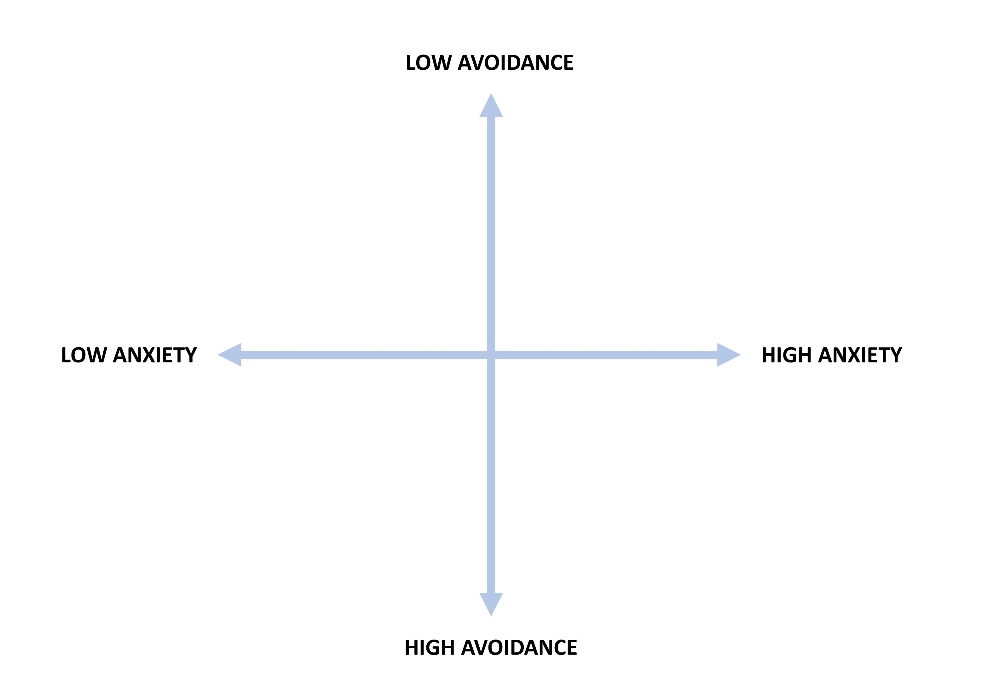

```{r setup, include=FALSE}
knitr::opts_chunk$set(echo = TRUE, eval = TRUE, warning = FALSE, message = FALSE)
suppressWarnings({
  library("rmarkdown")
  library("kableExtra")
  library("emo")
  library("GAabbreviate")
  library("ShortForm")
})
```

 on [Pexels](https://www.pexels.com/)](pexels-poranimm.jpg)

## Introduction

In the social and behavioral sciences, researchers often use surveys, questionnaires, or scales to collect data from a sample of participants. Such instruments provide an efficient and effective way to collect information about a large group of individuals.

> Surveys are used to collect information from or about people to describe, compare, or
explain their knowledge, feelings, values, and behaviors. [@fink2015conduct]

Sometimes respondents may get tired of answering the questions during the survey taking process---especially if the survey is very long. This is known as *survey taking fatigue*. The presence of survey taking fatigue can affect response quality significantly. When respondents get tired, they may skip questions, provide inaccurate responses due to insufficient effort responding, or even abandon the survey completely. To alleviate this issue, it is important to reduce survey length properly.

In the [first part of this series](https://okan.cloud/posts/2021-01-04-how-to-shorten-a-measurement-instrument-automatically-part-i/), I demonstrated how to use automated test assembly and recursive feature elimination to automatically shorten educational assessments (e.g., multiple-choice exams, tests, and quizzes). In the second part, I will demonstrate how to use the following optimization algorithmsfor creating shorter versions of surveys and similar instruments:

* Genetic algorithm (GA; `r ji("gene")`)
* Ant colony optimization (ACO; `r ji("ant")`)

### Optimization with GA and ACO

In computer science, a genetic algorithm (GA) is essentially a search heuristic that mimics Charles Darwin’s theory of natural evolution. The algorithm reflects the process of natural selection by iteratively selecting and mating strong individuals (i.e., solutions) that are more likely to survive and eliminating weak individuals from generating more weak individuals. This process continues until GA finds an optimal or acceptable solution.

> Genetic algorithms are commonly used to generate high-quality solutions to optimization and search problems by relying on biologically inspired operators such as mutation, crossover and selection. [@mitchell1998introduction]

In the context of survey abbreviation, GA can be used as an optimization tool for finding a subset of questions that maximally captures the variance (i.e., $R^2$) in the original data. @yarkoni2010abbreviation proposed the following cost function for scale abbreviation:

$$Cost = Ik + \Sigma^s_i w_i(1-R^2_i)$$
where $I$ represents a user-specified fixed item cost, $k$ represents the number of items to be retained by GA, $s$ is the number of subscales in the measure, $w_i$ are the weights associated with each subscale, and $R^2$ is the amount of variance in the $i^{th}$ subscale explained by its items. If the cost of retaining a particular item is larger than the loss in $R^2$, then the item is dropped from its subscale (i.e., GA returns a shorter subscale). @yarkoni2010abbreviation demonstrated the use of GA in abbreviating lengthy personality scales and thereafter many researchers have used GA to abbreviate psychological scales (e.g., @crone2020developing, @eisenbarth2015using, @gaarticle1)^[See Yarkoni's blog post on the use of GA at https://www.talyarkoni.org/blog/2010/03/31/abbreviating-personality-measures-in-r-a-tutorial/]. 

Like GA, the ant colony optimization (ACO) is also an optimization method. ACO was first inspired by the collective behavior of Argentine ants called *iridomyrmex humilis* [@goss1989self]. While searching for food, these ants drop pheromone on the ground and follow pheromone previously dropped by other ants. Since the shortest path is more likely to retain pheromone, ants are able to follow this path and find promising food sources more quickly. Figure 1 illustrates this process. 

![**Figure 1:** How real ants find a shortest path. (a) Ants arrive at a decision point. (b) Some ants choose the upper path and some the lower path. The choice is random. (c) Since ants move at approximately a constant speed, the ants which choose the lower, shorter, path reach the opposite decision point faster than those which choose the upper, longer, path. (d) Pheromone accumulates at a higher rate on the shorter path. The number of dashed lines is approximately proportional to the amount of pheromone deposited by ants (Obtained from @dorigo1996ant, page 54)](aco.png)

Engineers decided to use the way Argentine ant colonies function as an analogy to solve the shortest path problem and created the ACO algorithm [@dorigo1996ant; @dorigo1997ant]. Then, @marcoulides2003model applied ACO to model specification searches in structural equation modeling (SEM). The goal of this approach is to automate the model fitting process in SEM by starting with a user-specified model and then fitting alternative models to fix missing paths or parameters. This iterative process continues until an optimal model (e.g., a model with good model-fit indices) is identified. @leite2008item used the ACO algorithm for the development of short forms of scales and found that ACO outperformed traditionally used methods of item selection. In a more recent study, @falk demonstrated how to use ACO for model specification searches in R. 


## Example

In this example, we will use the [Experiences in Close Relationships (ECR)](http://labs.psychology.illinois.edu/~rcfraley/measures/brennan.html) scale [@brennan1998self]. The ECR scale consists of 36 items measuring two higher-order attachment dimensions for adults (18 items per dimension): avoidance and anxiety (see Figure 2)^[See <http://labs.psychology.illinois.edu/~rcfraley/measures/measures.html> for more information.]. The items are based on a 5-point Likert scale (i.e., 1 = strongly disagree to 5 = strongly agree). For each subscale (i.e., dimension), higher scores indicate higher levels of avoidance (or anxiety). Individuals who score high on either or both of these dimensions are assumed to have an insecure adult attachment orientation [@wei2007experiences].



@wei2007experiences developed a 12-item, short form of the ERC scale using traditional methods (e.g., dropping items with low item-total correlation and keeping items with the highest factor loadings). In our example, we will use the GA and ACO algorithms to automatically select the best items for the two subscales of the ECR scale. The [original data set](http://openpsychometrics.org/_rawdata/ECR-data-1March2018.zip) for the ERC scale is available on the Open-Source Psychometric Project [website](https://openpsychometrics.org/). For demonstration purposes, we will use a subset ($n = 10,798$) of the original data set based on the following rules: 

* Respondents must participate the survey from the United States, and
* Respondents must be between 18 and 30 years of age. 

In the ERC scale, some items are positively phrased and thus indicate lower avoidance (or anxiety) for respondents. Therefore, these items (items 3, 15, 19, 22, 25, 29, 31, 33, 35) have been reverse-coded^[See the full list of questions at <http://labs.psychology.illinois.edu/~rcfraley/measures/brennan.html>.]. Lastly, the respondents with missing responses have been eliminated from the data set. The final data set is available [here](https://raw.githubusercontent.com/okanbulut/tds/main/scale_abbreviation/ecr_data.csv). 

Now, let's import the data into R and then preview its content. 

```{r, echo=TRUE, eval=FALSE}
ecr <- read.csv("ecr_data.csv", header = TRUE)
```

```{r, echo=FALSE, eval=TRUE}
ecr <- read.csv("ecr_data.csv", header = TRUE)

paged_table(ecr, options = list(cols.print = 12))
```

Next, we will review inter-item correlations for each subscale to confirm that the items within each subscale are in the same direction. The odd-numbered items belong to the Avoidance subscale, while the even-numbered items belong to the Anxiety subscale.

```{r, echo=TRUE, eval=TRUE}
library("DataExplorer")

# Avoidance subscale
plot_correlation(ecr[, seq(1, 35, by = 2)])

# Anxiety subscale
plot_correlation(ecr[, seq(2, 36, by = 2)])
```

The two correlation matrix plots above indicate that the items within each subscale are positively correlated with each other (i.e., the responses are in the same direction). 

Lastly, we will check the reliability (i.e, coefficient alpha) for each subscale based on the original number of items (i.e., 18 items per subscale).

```{r, echo=TRUE, eval=TRUE}
# Avoidance subscale
psych::alpha(ecr[, seq(1, 35, by = 2)])$total

# Anxiety subscale
psych::alpha(ecr[, seq(2, 36, by = 2)])$total
```

Now, we will go ahead and shorten the instrument using GA and ACO. 

### Automatic Selection of Items

**Goal:** Using both GA and ACO, we aim to select six items for each subscale. That is, we want to create a short version of the ECR scale with 12 items in total. 

**Assumptions:** We will assume that: (1) the items that belong to each subscale measure the same latent trait (i.e., either avoidance or anxiety) and the subscales do not exhibit any psychometric issues (e.g., differential item functioning).

**Methodology:** We will use the GA and ACO algorithms to automatically select the items from the ECR subscale. Although these algorithms aim to shorten the subscales, they follow selection mechanisms based on different criteria. These will be explained in the following sections. 


### Genetic Algorithm 

We will use the **GAabbreviate** function from the **GAabbreviate** package [@gaabbreviate] to implement GA for scale abbreviation. 

```{r, echo=TRUE, eval=FALSE}
library("GAabbreviate")
```

**Step 1:** We will create scale scores by summing up the item scores for each dimension^[Instead of raw scale scores, we could also obtain factor scores or IRT-based scores.]. As mentioned earlier, the odd-numbered items define "Avoidance" and the even-numbered items define "Anxiety". 

```{r, echo=TRUE, eval=TRUE}
scales = cbind(rowSums(ecr[, seq(1, 35, by = 2)]), 
               rowSums(ecr[, seq(2, 36, by = 2)])
               )
```

**Step 2:** We will transform the responses into an integer and then save the response data set as a matrix.

```{r, echo=TRUE, eval=TRUE}
ecr <- as.data.frame(sapply(ecr, as.integer))
ecr <- matrix(as.integer(unlist(ecr)), nrow=nrow(ecr))
```

**Step 3:** We will use the **GAabbreviate** function to execute the GA algorithm. In the function, a few parameters need to be determined by trial and error. For example, **itemCost** refers to the fitness cost of each item. The default value in the function is 0.05. By lowering or increasing the cost, we can check whether the function is able to shorten the scale (or subscales) based on the target length (which is 12 items in our example; 6 items per subscale). Similarly, the maximum number of iterations (**maxiter**) can be increased if the function is not able to find a solution within the default number of iterations (100). 

```{r, echo=TRUE, eval=FALSE}
ecr_GA = GAabbreviate(items = ecr, # Matrix of item responses
                      scales = scales, # Scale scores
                      itemCost = 0.01, # The cost of each item
                      maxItems = 6, # Max number of items per dimension
                      maxiter = 1000, # Max number of iterations
                      run = 100, # Number of runs
                      crossVal = TRUE, # Cross-validation
                      seed = 2021) # Seed for reproducibility
```

```{r, echo=FALSE, eval=TRUE}
ecr_GA = GAabbreviate(items = ecr, # Matrix of item responses
                      scales = scales, # Scale scores
                      itemCost = 0.01, # The cost of each item
                      maxItems = 6, # Max number of items per dimension
                      maxiter = 1000, # Max number of iterations
                      run = 100, # Number of runs
                      crossVal = TRUE, # Cross-validation
                      seed = 2021) # Seed for reproducibility
```

Once the **GAabbreviate** function begins to run, the iteration information during the search is displayed:

```{r, echo=TRUE, eval=FALSE}
Starting GA run...
Iter = 1  | Mean = 0.4265  | Best = 0.3455 
Iter = 2  | Mean = 0.4238  | Best = 0.3455 
Iter = 3  | Mean = 0.4204  | Best = 0.3334 
Iter = 4  | Mean = 0.4101  | Best = 0.3255 
Iter = 5  | Mean = 0.4028  | Best = 0.3255 
Iter = 6  | Mean = 0.3983  | Best = 0.3175 
Iter = 7  | Mean = 0.3913  | Best = 0.3175 
Iter = 8  | Mean = 0.3983  | Best = 0.3175 
Iter = 9  | Mean = 0.3926  | Best = 0.3175 
Iter = 10 | Mean = 0.3927  | Best = 0.3175 
Iter = 11 | Mean = 0.3898  | Best = 0.3175 
.
.
.
.
```


**Step 4:** If the **GAabbreviate** function finds an optimal solution before the maximum number of iterations, it automatically stops; otherwise, it continues until the maximum number of iterations is reached.Then, we can view the results as follows: 

```{r, echo=TRUE, eval=TRUE}
ecr_GA$measure
```

The output shows a list of which items have been selected (items) and which of those items belong to each dimension (key). To combine the two pieces together, we can use the following:

```{r, echo=TRUE, eval=TRUE}
avoidance <- which(ecr_GA$measure$key[,1]==1)
anxiety <- which(ecr_GA$measure$key[,2]==1)

# Avoidance items
ecr_GA$measure$items[avoidance]

# Anxiety items
ecr_GA$measure$items[anxiety]
```

Furthermore, we can see a visual summary of the search process using the **plot** function:

```{r, echo=TRUE, eval=TRUE}
plot(ecr_GA)
```

### Ant Colony Optimization

We will use the **antcolony.lavaan** function from the **ShortForm** package [@shortform] to implement ACO for scale abbreviation. 

```{r, echo=TRUE, eval=FALSE}
library("ShortForm")
```

**Step 1:** We will save the response data set as a data.frame because the **antcolony.lavaan** function requires the data to be in a data frame format. This step is necessary because for the **GAabbreviate** function, we have transformed our data set into a matrix. So, we will need to change the format back to a data frame and rename the columns as before. 

```{r, echo=TRUE, eval=TRUE}
ecr <- as.data.frame(ecr)
names(ecr) <- paste0("Q", 1:36)
```

**Step 2:** We will define the factorial structure underlying the ECR scale. That is, there are two dimensions (Avoidance and Anxiety) and each dimension is defined by 18 items. To define the factorial model, we need to use the language of the **lavaan** package^[See <https://lavaan.ugent.be/> for more information about **lavaan**.].

```{r, echo=TRUE, eval=TRUE}
model <- 'Avoidance =~ Q1+Q3+Q5+Q7+Q9+Q11+Q13+Q15+Q17+Q19+Q21+Q23+Q25+Q27+Q29+Q31+Q33+Q35
          Anxiety =~ Q2+Q4+Q6+Q8+Q10+Q12+Q14+Q16+Q18+Q20+Q22+Q24+Q26+Q28+Q30+Q32+Q34+Q36'
```

**Step 3:** Next, we will define which items can be used for each dimension. Although we have already defined the model above, this step is still necessary to tell the function which items are candidate items for each dimension during the item selection process. So, we will create a list of item names for each factor.

```{r, echo=TRUE, eval=TRUE}
items <- list(c(paste0("Q", seq(1, 35, by = 2))),
              c(paste0("Q", seq(2, 36, by = 2))))
```

**Step 4:** We will put everything together to implement the ACO algorithm. When preparing the **antcolony.lavaan** function, we will use the default values. However, some parameters, such as ants, evaporation, and steps, could be modified to find an optimal result (or reduce the computation time). The only parameter we will change is the estimator for the model. By default, **lavaan** uses maximum likelihood but we should select the weighted least square mean and variance adjusted (WLSMV) estimator because it is more robust to non-normality in the data (which is quite likely given the Likert scale established for the ECR scale). By default, the **antcolony.lavaan** function uses @hu1999cutoff's guidelines for fit indices to evaluate model fit: (1) Comparative fit index (CFI) > .95; Tucker-Lewis index (TLI) > .95; and root mean square error of approximation (RMSEA) < .06.

```{r, echo=TRUE, eval=TRUE, include=FALSE}
ecr_ACO <- antcolony.lavaan(data = ecr, # Response data set
                            ants = 20, # Number of ants
                            evaporation = 0.9, #  % of the pheromone retained after evaporation
                            antModel = model, # Factor model for ECR
                            list.items = items, # Items for each dimension
                            full = 36, # The total number of unique items in the ECR scale
                            i.per.f = c(6, 6), # The desired number of items per dimension
                            factors = c('Avoidance','Anxiety'), # Names of dimensions
                            # lavaan settings - Change estimator to WLSMV
                            lavaan.model.specs = list(model.type = "cfa", auto.var = T, estimator = "WLSMV",
                                                      ordered = NULL, int.ov.free = TRUE, int.lv.free = FALSE, 
                                                      auto.fix.first = TRUE, auto.fix.single = TRUE, 
                                                      auto.cov.lv.x = TRUE, auto.th = TRUE, auto.delta = TRUE,
                                                      auto.cov.y = TRUE, std.lv = F),
                            steps = 50, # The number of ants in a row for which the model does not change
                            fit.indices = c('cfi', 'tli', 'rmsea'), # Fit statistics to use
                            fit.statistics.test = "(cfi > 0.95)&(tli > 0.95)&(rmsea < 0.06)",
                            max.run = 1000) # The maximum number of ants to run before the algorithm stops
```


```{r, echo=TRUE, eval=FALSE}
ecr_ACO <- antcolony.lavaan(data = ecr, # Response data set
                            ants = 20, # Number of ants
                            evaporation = 0.9, #  % of the pheromone retained after evaporation
                            antModel = model, # Factor model for ECR
                            list.items = items, # Items for each dimension
                            full = 36, # The total number of unique items in the ECR scale
                            i.per.f = c(6, 6), # The desired number of items per dimension
                            factors = c('Avoidance','Anxiety'), # Names of dimensions
                            # lavaan settings - Change estimator to WLSMV
                            lavaan.model.specs = list(model.type = "cfa", auto.var = T, estimator = "WLSMV",
                                                      ordered = NULL, int.ov.free = TRUE, int.lv.free = FALSE, 
                                                      auto.fix.first = TRUE, auto.fix.single = TRUE, 
                                                      auto.cov.lv.x = TRUE, auto.th = TRUE, auto.delta = TRUE,
                                                      auto.cov.y = TRUE, std.lv = F),
                            steps = 50, # The number of ants in a row for which the model does not change
                            fit.indices = c('cfi', 'tli', 'rmsea'), # Fit statistics to use
                            fit.statistics.test = "(cfi > 0.95)&(tli > 0.95)&(rmsea < 0.06)",
                            max.run = 1000) # The maximum number of ants to run before the algorithm stops
```

**Step 5:** In the final step, we will review the results. First, we will see the model fit indices and which items have been selected by ACO.

```{r, echo=TRUE, eval=TRUE}
ecr_ACO[[1]]

# Uncomment to print the entire model output
# print(ecr_AC) 
```

Next, we will check which items have been selected for each dimension. The following will return the lavaan syntax that can be used to estimate the same two-factor model with 12 items:

```{r, echo=TRUE, eval=TRUE}
cat(ecr_ACO$best.syntax)
```

We can also visualize the results returned from **antcolony.lavaan**. For example, we can see changes in the amount of variance explained in the model across each iteration of the algorithm.

```{r, echo=TRUE, eval=TRUE}
plot(ecr_ACO, type = "variance")

# Other alternative plots
# plot(ecr_ACO, type = "gamma")
# plot(ecr_ACO, type = "pheromone")
```

Lastly, we will check the reliability levels of the shortened subscales based on the items recommended by ACO.

```{r, echo=TRUE, eval=TRUE}
# Avoidance subscale
psych::alpha(ecr[, c("Q7", "Q17", "Q13", "Q9", "Q5", "Q3")])$total

# Anxiety subscale
psych::alpha(ecr[, c("Q2", "Q10", "Q6", "Q22", "Q8", "Q4")])$total
```

## Conclusion

xxx


