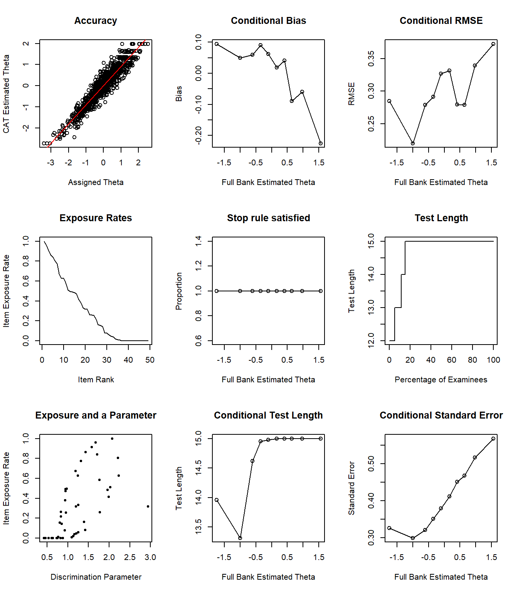

```{r setup, include=FALSE}
knitr::opts_chunk$set(echo = TRUE, eval = TRUE, warning = FALSE, message = FALSE)
suppressWarnings({
  library("rmarkdown")
  library("kableExtra")
  library("emo")
  library("DataExplorer")
  #library("psych")
  library("ggplot2")
  library("gganimate")
  library("mirt")
  library("catR")
})
```

 on [Unsplash](https://unsplash.com/)](computer.jpg)

## Introduction

Psychologists, counselors, educators, and other practitioners often rely on educational and psychological instruments--such as tests, questionnaires, and inventories--to make informed decisions about individuals. Most educational and psychological instruments in use today follow the traditional approach of asking as many items as possible via a paper-and-pencil assessment. Although this approach is likely to increase the internal consistency of the instrument, it may lead to some unintended consequences, such as having low-quality responses due to test fatigue and test-taking disengagement. Therefore, many researchers have proposed systematic ways to shorten educational and psychological instruments [@chongming2010; @sandy2014; @yarkoni2010].

In my previous posts, I demonstrated how to shorten measurement instruments using psychometric methods such as [automated test assembly](https://okan.cloud/posts/2021-01-04-how-to-shorten-a-measurement-instrument-automatically-part-i/) and data science methods such as [the ant colony optimization](https://okan.cloud/posts/2021-01-19-how-to-shorten-a-measurement-instrument-automatically-part-ii/). These methods can help researchers and practitioners build a shorter version of an instrument and thereby increasing measurement efficiency. However, as @weiss2004 pointed out, conventional assessments with fixed items (i.e., the same items being used for everyone) tend to yield accurate results for individuals whose trait levels are around the mean of the target population but yield poor measurement results for those whose latent trait levels deviate from the mean.    

A promising solution to creating assessments with high measurement accuracy for all individuals is the use of adaptive testing. Adaptive testing follows the idea of adapting an assessment to each individual's latent trait level by administering a customized set of items, instead of administering the same set of items to all individuals. In this post, I will briefly explain how adaptive testing works and then demonstrate how to create a computerized adaptive version of an existing psychological instrument.

## Computerized Adaptive Testing

Computerized adaptive testing (CAT) is a sophisticated method of delivering computerized assessments with high measurement precision and efficiency [@thompson2011; @weiss2004]. The primary goal of CAT is to customize the assessment for each individual by selecting the most suitable items based on their responses to the previously administered questions. To design and implement a CAT, the following five components are necessary [@thompson2011]:

* **Item bank:** A large pool of items calibrated with a particular item response theory (IRT) model
* **Starting point:** The point where the test begins (e.g., administering a particular item to everyone or assuming $\theta = 0$ for all individuals)
* **Item selection algorithm:** How CAT will determine which items should be administered (e.g., Maximum Fisher Information for selecting the most informative item)
* **Scoring algorithm:** How latent trait levels will be estimated after each response (e.g., Maximum Likelihood or Expected a Posteriori)
* **Test termination criteria:** How CAT will terminate the test (e.g., answering the maximum number of items or reaching a particular level of measurement precision)

In a typical CAT, each individual begins to receive items at a particular level (e.g., $\theta = 0$). Then, depending on the answer, the next item becomes less or more difficult. For example, if the individual answers an item with moderate difficulty correctly, then the CAT assumes that this individual’s latent trait level is above the difficulty level of the question and thus it presents a more difficult question in the next round. If, however, the individual is not able to answer the item correctly, then she/he is administered an easier question in the next round. this iterative process continues until a test termination criterion is met (e.g., answering the maximum number of questions).

Before implementing a CAT, it is important to obtain enough evidence to support its use in operational settings. For example, if researchers aim to redesign a conventional, non-adaptive instrument as a CAT, then a series of post-hoc simulations can be conducted using previously collected data. A post-hoc simulation is a psychometric procedure to evaluate the effect of different CAT algorithms under specific conditions [@seo2018]. Using real data from a conventional instrument taken by a large group of individuals, one can create a hypothetical CAT scenario and evaluate the impact of various CAT elements (e.g., different algorithms for item selection or scoring) on measurement accuracy and efficiency. The results of these simulations can help researchers and practitioners determine the feasibility and applicability of the CAT approach for an existing instrument. 

## Example

In this example, we will use real data from a sample of respondents ($n = 4474$) who responded to the items in the [Taylor Manifest Anxiety Scale](https://openpsychometrics.org/tests/TMAS/) [@taylor1953] and build a CAT version of this instrument through post-hoc simulations. The Taylor Manifest Anxiety Scale is typically used for measuring anxiety as a personality trait. The scale consists of fifty statements about different indicators of anxiety. For each item, individuals select either true or false. The higher the score, the higher the anxiety level. Because some items on the scale are negatively phrased, they must be reverse-coded^[Items 1, 3, 4, 9, 12, 15, 18, 20, 29, 32, 38, and 50 were reverse-coded.]. A clean version of the data (including reverse-coding) is available [here](https://raw.githubusercontent.com/okanbulut/blog/master/data_and_codes/tma_data.csv). Now let's import the data and check out its content. 


```{r chunk1, eval=FALSE}
# Import the TMA data into R
data <- read.csv("tma_data.csv", header = TRUE)

# Preview the data
head(data)
```

```{r chunk2, eval=TRUE, echo=FALSE}
data <- read.csv("tma_data.csv", header = TRUE)
paged_table(data, options = list(cols.print = 12))
```

Before we start using the data for conducting simulations, we will check psychometric properties of the items. Specifically, we will check the inter-item correlations and point-biserial correlations (i.e., item discrimination) to ensure that the items contribute to the scale sufficiently. 

```{r chunk3, eval = FALSE}
library("DataExplorer")

plot_correlation(data)
```

```{r corplot, eval = TRUE, echo=FALSE, fig.cap="Inter-item Correlations in the Taylor Manifest Anxiety Scale", fig.width=6, fig.height=6}
plot_correlation(data)
```

Figure \@ref(fig:corplot) shows that item 15 has a very low correlation with the rest of the items on the scale. Therefore, we will check item discrimination (i.e., point-biserial correlations) to examine whether item 5, as well as the remaining items, might be problematic. We will use $r = 0.20$ as a threshold to identify problematic items. 

```{r chunk4, eval = FALSE}
library("psych")
library("ggplot2")

item_summary <- data.frame(Items = factor(colnames(data), levels = colnames(data)),
                           Discrimination = psych::alpha(data)$item.stats$r.cor)

ggplot(data = item_summary, 
       aes(x = Items, y = Discrimination, colour = Discrimination > 0.20)) +
  geom_point(size = 3) + ylim(0, 1) +
  geom_hline(yintercept = 0.20, linetype="dashed", colour = "red", size = 1) +
  labs(x = "Items", "Discrimination") +
  coord_flip() +
  theme_bw()
```

```{r discplot, eval = TRUE, echo=FALSE, fig.cap="Item Discrimination Values in the Taylor Manifest Anxiety Scale", fig.width=7, fig.height=6}
item_summary <- data.frame(Items = factor(colnames(data), levels = colnames(data)),
                           Discrimination = psych::alpha(data)$item.stats$r.cor)

ggplot(data = item_summary, 
       aes(x = Items, y = Discrimination, colour = Discrimination > 0.20)) +
  geom_point(size = 3) + ylim(0, 1) +
  geom_hline(yintercept = 0.20, linetype="dashed", colour = "red", size = 1) +
  labs(x = "Items", "Discrimination") +
  coord_flip() +
  theme_bw()
```

Figure \@ref(fig:discplot) suggests that item 15 is weakly correlated with the rest of the items on the scale and thus its discrimination value is below 0.20. We can also check the internal consistency of the scale, with and without this item, to see the impact of removing this particular item from the scale. 

```{r chunk5, echo=TRUE}
cat("Coefficient alpha with all items:", psych::alpha(data)$total$raw_alpha)

cat("Coefficient alpha without item 15:", psych::alpha(data)$alpha.drop$raw_alpha[15])
```

We can see that removing item 15 does not decrease the internal consistency of the scale; but rather it slightly increases the coefficient alpha. Therefore, we will leave item 15 out of the subsequent analyses.

```{r chunk6, echo=TRUE}
data <- data[,-c(15)]
```

Since the CAT requires IRT-based item parameters, we will calibrate the items using a particular IRT model. The Taylor Manifest Anxiety Scale is not an achievement test and thus guessing would not be a concern. Thus, we will choose the 2-parameter logistic (2PL) model to calibrate the items and then save the estimated parameters as well as the theta (i.e., anxiety) scores. We will use the **mirt** package [@mirt] for the IRT estimation. 

```{r chunk7, eval = FALSE}
library("mirt")

# Model estimation
mod <- 'F = 1-49' 
model.2pl <- mirt(data=data, model=mod, itemtype="2PL", SE=TRUE)

# Saving item parameters as a matrix
parameters <- coef(model.2pl, IRTpars = TRUE, simplify=TRUE)$items
parameters <- as.matrix(parameters)
colnames(parameters) <- c("a","b","c","d")
head(parameters)

# Saving theta values as a matrix
theta <- fscores(model.2pl, method = "EAP")
theta <- as.matrix(theta)
```

```{r chunk8, eval = TRUE, echo=FALSE}
# Model estimation
mod <- 'F = 1-49' 
model.2pl <- mirt(data=data, model=mod, itemtype="2PL", SE=TRUE, verbose=FALSE)

# Saving item parameters as a matrix
parameters <- coef(model.2pl, IRTpars = TRUE, simplify=TRUE)$items
parameters <- as.matrix(parameters)
colnames(parameters) <- c("a","b","c","d")
paged_table(as.data.frame(parameters), options = list(cols.print = 12))

# Saving theta values as a matrix
theta <- fscores(model.2pl, method = "EAP")
theta <- as.matrix(theta)
```

Now we can check out the test information function for the entire scale. Figure \@ref(fig:tifplot) indicates that the scale is mostly informative between $\theta = -3$ and $\theta = 2$. 

```{r chunk9, eval = FALSE}
mirt::plot(model.2pl, type = 'infoSE', theta_lim=c(-5,5), 
           auto.key = list(points=TRUE, lines=TRUE, columns=2, space = "top"),
           par.settings = list(superpose.line = list(col = "black", lty = 1:2, lwd = 2)))
```

```{r tifplot, eval = TRUE, echo=FALSE, fig.cap="Test Information Function and Standard Error of Measurement"}
mirt::plot(model.2pl, type = 'infoSE', theta_lim=c(-5,5), 
           auto.key = list(points=TRUE, lines=TRUE, columns=2, space = "top"),
           par.settings = list(superpose.line = list(col = "black", lty = 1:2, lwd = 2)))
```

Using the item parameters and theta values we have estimated above, we will design a hypothetical CAT scenario. Our goal is to check the feasibility of using the Taylor Manifest Anxiety Scale as a computerized adaptive scale. Therefore, we will run post-hoc simulations using real responses in the data and let the CAT system select the optimal items for each person. Then, we will compare the final theta estimates from the CAT with the original calibration based on all the items. 

To run post hoc simulations, we will use the **catR** package [@catr].

```{r chunk10, eval = FALSE}
library("catR")
```

In the simulation, we will use the following design:

* the item bank consists of 49 items,
* the starting theta level is $\theta = 0$ for all individuals,
* the Maximum Fisher Information (MFI) will be used for selecting the items,
* Expected a Posteriori (EAP) will be used for estimating both interim theta values and final theta values, and
* each person will be able to answer up to 10 items in the scale but if a person's theta estimate is precise enough (i.e., SEM < 0.3), CAT will terminate the test before reaching 10 items. 

Before starting the simulation with the whole data, we will test our CAT system using a single iteration. We will use the randomCAT function to simulate responses for a hypothetical person who takes the Taylor Manifest Anxiety Scale. We will assume that the person's true theta level is $\theta = 0$.

```{r chunk11, eval=TRUE}
sim1 <- randomCAT(trueTheta = 0, 
                  # Item bank
                  itemBank = parameters,
                  # Set the seed to ensure reproducibility
                  genSeed = 666,
                  # Starting rules for CAT 
                  start = list(startSelect="MFI"), 
                  # Test administration rules for CAT
                  test = list(method="EAP", itemSelect="MFI"),
                  # Stopping rule for CAT
                  stop = list(rule = c("precision", "length"), thr = c(0.3, 10)), 
                  # Final ability estimation
                  final = list(method = "EAP"),
                  # Save all interim theta and SEM values
                  allTheta = TRUE)
```

Now we can see how the response process worked for this hypothetical person. The plot_cat function will create an animated plot that shows how theta estimates and 95% SEM band change after administering each item. A function to create a static version of the same plot is available [here](https://raw.githubusercontent.com/okanbulut/blog/master/_posts/2021-02-16-shortening-psychological-scales-using-computerized-adaptive-testing/plot_cat.R)^[This function has been inspired by the plot.cat function in the [xxIRT](https://cran.r-project.org/web/packages/xxIRT/index.html) package.].

```{r catplot, fig.width=9, fig.height=6, fig.cap="Interim Theta and SEM Estimates in CAT"}
plot_cat <- function(model) {
  require("ggplot2")
  require("gganimate")
  
  # Summarize the results
  cat_summary <- data.frame(
    items = factor(model$testItems, levels = model$testItems),
    thetas = model$thetaProv,
    theta_lb = model$thetaProv - 1.96 * model$seProv,
    theta_ub = model$thetaProv + 1.96 * model$seProv,
    wr = factor(model$pattern, levels=c(0, 1), labels=c("Wrong", "Right")))
  
  # Prepare the animated dot plot
  p1 <- ggplot(data=cat_summary, aes(x=items, y=thetas, color=wr)) + 
    geom_point(aes(group = seq_along(items)), size = 5) +
    geom_linerange(aes(ymin=theta_lb, ymax=theta_ub), size = 1.5, alpha = 0.4) +
    geom_point(aes(x=tail(items, n = 1), y=tail(thetas, n = 1)), color="black", pch=4, size=5) +
    geom_hline(aes(yintercept = model$trueTheta), 
               color="#808080", linetype="dotted", size = 1.5, alpha = 0.7) +
    transition_states(items)+
    coord_cartesian(ylim=c(-4, 4)) + 
    scale_size_continuous(range=c(1, 3)) +
    labs(x = "Items", y = expression(paste("Estimated ", theta)), color = "Response",
         caption = "Note: The dotted horizontal line represents the true theta level.") +
    guides(size=F, alpha=F) + 
    theme_bw(base_size = 19) + 
    theme(legend.key=element_blank(),
          plot.caption = element_text(hjust = 0))
  
  # Turn it into an animation
  p2 <- animate(p1, 
                nframes = 250,
                fps = 25, 
                width = 900, 
                height = 600)
  
  return(p2)
}


plot_cat(sim1)
```


Figure \@ref(fig:catplot) shows that the 95% SEM band around the theta estimate is getting narrower after administering each item, indicating that the theta estimate is becoming more precise. The final theta estimate is shown with "X" on the right-hand side of the plot. After 10 items, the final theta estimate appears to be very close to the true theta value (see the dotted horizontal line).  

To run a post hoc CAT simulation with real responses in the data, we will use the simulateRespondents function in the **catR** package. To keep our example simple, we will choose a random sample of 1000 persons (out of 4474 persons) and test the CAT system with this sample. 

```{r chunk12, eval = TRUE, echo=TRUE, warning=FALSE, message=FALSE, results = 'hide'}
# Set the seed to ensure reproducibility
set.seed(2021)

# A random sample of 1000 persons
persons <- sample.int(1000, n = nrow(theta))

# Post hoc simulation #1
sim2 <- simulateRespondents(thetas = theta[persons,],
                            # Item bank
                            itemBank = parameters, 
                            # Real responses in the data
                            responsesMatrix = data[persons,],
                            # Starting rules for CAT  
                            start = list(startSelect="MFI"),
                            # Test administration rules for CAT
                            test = list(method="EAP", itemSelect="MFI"),
                            # Stopping rule for CAT
                            stop = list(rule = c("precision", "length"), thr = c(0.3, 10)),
                            # Final ability estimation
                            final = list(method = "EAP")
)
```

Now, let's see the simulation output.

```{r chunk13, eval=TRUE}
# Statistical summary of results
print(sim2)
```

The simulateRespondents function returns a detailed output of the simulation results. The correlation between the true (i.e., theta based on all 49 items) and estimated theta values is $r = 0.912$. This is is a good result because even with 10 items, individuals' estimated theta levels are highly correlated with their true theta levels. We can also see that RMSE is 0.386 and bias is 0.009. We are not going to focus on the item exposure results since we did not apply any method to control item exposure given the small size of our item bank. 

Next, we will review the "Condition Results" section. The output is split by the latent trait groups (i.e., D1 to D10). This allows us to evaluate the performance of the CAT system across different latent trait levels. We can see that both RMSE and bias are quite high for D1 and D10 (i.e., very low anxiety and very high anxiety groups). This is not a surprising finding given the small size of the item bank. Mean test length indicates that all individuals finished the scale with 10 items. That is, SEM could not be minimized below 0.3 and thus there was no early termination. The row of "Mean standard error" also confirms that the average SEM was higher than 0.3 for all latent trait groups. 

We can also take a look at the visual summary of the results using the plot function. 

```{r chunk14, eval=FALSE}
# Visual summary of results
plot(sim2)
```

```{r plotsim2, echo = FALSE, fig.cap="Simulation Results", fig.width=7, fig.height=8}
# Visual summary of results
knitr::include_graphics("sim2_plot.png")
```

Figure \@ref(fig:plotsim2) consists of several plots. The accuracy plot shows the alignment between estimated and true theta values. The following figures show a breakdown of bias and RMSE across different theta levels. The test length plot shows that all examinees responded to 10 items, confirming the results we have seen earlier. Lastly, the conditional standard error plot shows that SEM becomes quite high for individuals whose theta level is around $\theta = 0.5$ or higher. 

In the next simulation, we will keep all the design elements the same but increase the maximum number of items to 15. We will see if administering up to 15 items will reduce bias and RMSE and increase the correlation between true and estimated theta values.

```{r chunk15, eval = TRUE, echo=TRUE, warning=FALSE, message=FALSE, results = 'hide'}
# Post hoc simulation #2
sim3 <- simulateRespondents(thetas = theta[persons,],
                            # Item bank
                            itemBank = parameters, 
                            # Real responses in the data
                            responsesMatrix = data[persons,],
                            # Starting rules for CAT  
                            start = list(startSelect="MFI"),
                            # Test administration rules for CAT
                            test = list(method="EAP", itemSelect="MFI"),
                            # Stopping rule for CAT
                            stop = list(rule = c("precision", "length"), thr = c(0.3, 15)),
                            # Final ability estimation
                            final = list(method = "EAP")
)
```

Now, let's see the simulation output.

```{r chunk16, eval=TRUE}
# Statistical summary of results
print(sim3)
```

The new output shows that the correlation between the estimated and true levels increased: $r = 0.947$. Furthermore, both RMSE (0.303) and bias (0.004) decreased. Overall, increasing the maximum test length from 10 items to 15 items appears to improve the precision of the estimation. The mean test length is around 14.68 items, indicating that the CAT terminated early with less than 15 items at least for some individuals. When we review bias, RMSE, and mean standard error across the 10 latent trait groups, we see that increasing the maximum test length improved the precision of theta estimates for all groups.

Finally, we can check out the visual summary of the simulation. Figure \@ref(fig:plotsim3) so that approximately 20% of the individuals answered fewer than 15 items, whereas the remaining individuals answered 15 items before the CAT was terminated. Individuals whose theta levels are between -2 and -0.5 mostly answer fewer than 15 items. 

```{r chunk17, eval=FALSE}
# Visual summary of results
plot(sim3)
```

```{r plotsim3, echo = FALSE, fig.cap="Simulation Results", fig.width=7, fig.height=8}
# Visual summary of results

```

## Conclusion

The post-hoc simulation results show that the Taylor Manifest Anxiety Scale can be used as a computerized adaptive instrument. The CAT can shorten the length of the scale without compromising measurement precision. With up to 15 items, the correlation between the estimated and full-scale theta values becomes very high. However, it should be noted that especially for high levels of anxiety, the CAT does not seem to yield highly accurate results. This is directly related to the quality and size of the item bank (only 49 items). For the Taylor Manifest Anxiety Scale to be very accurate in measuring anxiety, the item bank requires additional items that could measure higher levels of anxiety. For a more detailed investigation of the item bank, the randomCAT function could be used to design Monte Carlo simulations based on hypothetical individuals with high levels of anxiety. This simulation can further help researchers determine what type of items they need if they decide to expand the item bank. 

