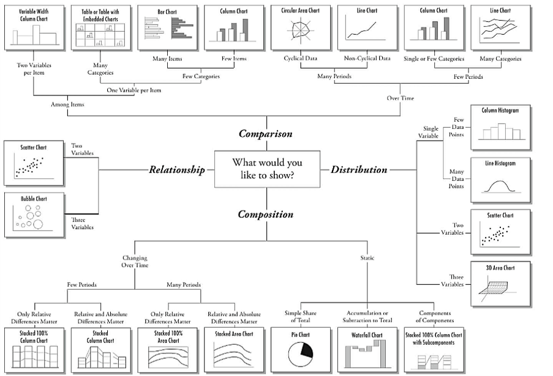
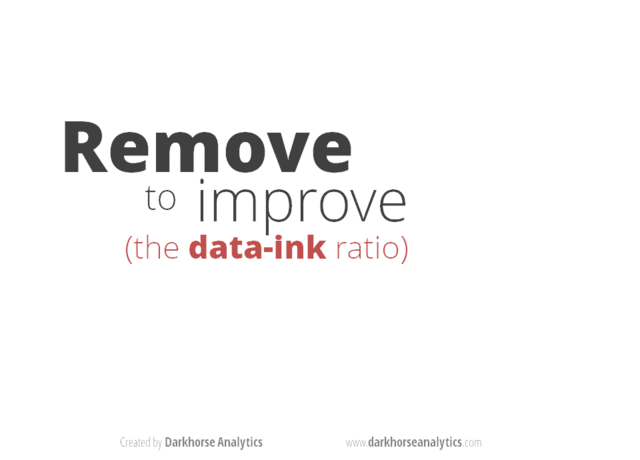

```{r setup, include=FALSE}
knitr::opts_chunk$set(echo = TRUE, eval = TRUE, warning = FALSE, message = FALSE)
suppressWarnings({
  library("rmarkdown")
  library("kableExtra")
  library("emo")
  library("dplyr")
  library("ggplot2")
  library("ggcorplot")
  library("naniar")
  library("ggalluvial")
})
```


 on [pixabay](https://pixabay.com/)](gui.png)

## Introduction

In CSSE 2019, I gave a half-day training on how to visualize assessment and survey items effectively (the training slides are available on [my GitHub page](https://github.com/okanbulut/dataviz/raw/master/CSSE_Workshop.pdf))^[The other training materials are available at <https://github.com/okanbulut/dataviz>.].


```{r dataviz, echo = FALSE, fig.cap="Types of data visualization (Source: https://extremepresentation.com/)", out.extra="class=external", fig.width=6, fig.height=4, layout="l-body-outset"}
# Visual summary of results

```


```{r nakeddata, echo = FALSE, fig.cap="Types of data visualization (Source: https://www.darkhorseanalytics.com/blog/data-looks-better-naked)", out.extra="class=external", fig.width=8, fig.height=6}
# Visual summary of results

```

## Example

xxx

To what extent do you disagree or agree about yourself?

ST082Q01NA I prefer working as part of a team to working alone.
ST082Q02NA I am a good listener.
ST082Q03NA I enjoy seeing my classmates be successful.
ST082Q08NA I take into account what others are interested in.
ST082Q09NA I find that teams make better decisions than individuals.
ST082Q12NA I enjoy considering different perspectives.
ST082Q13NA I find that teamwork raises my own efficiency.
ST082Q14NA I enjoy cooperating with peers.
ST034Q02TA I make friends easily at school.
ST034Q05TA Other students seem to like me.

1 = Strongly disagree
2 = Disagree
3 = Agree
4 = Strongly Agree


```{r ch0, eval=FALSE}
# Read the data in R
data <- read.csv("PISA_Alberta.csv", header = TRUE, na.strings = 999)

# Preview the data
head(data)
```


```{r ch1, echo=FALSE}
# Read the data in R
data <- read.csv("PISA_Alberta.csv", header = TRUE, na.strings = 999)
paged_table(data, options = list(cols.print = 12))
```


```{r ch2, eval=FALSE}
library("dplyr") 

data <- mutate(data,
               gender = ifelse(ST004D01T == 1, "Female", "Male"),
               immigration = ifelse(is.na(IMMIG), NA, ifelse(IMMIG == 1, "Native", 
                                           ifelse(IMMIG == 2, "Second-Generation", 
                                                  "First-Generation")))) %>%
  rename(grade = ST001D01T)
```


```{r ch3,eval=FALSE}
library("naniar")

# Select only the survey items
gg_miss_upset(data[, 6:15], nsets = 10)
```


```{r ch4,echo=FALSE, fig.width=6, fig.height=5, layout="l-body-outset", fig.cap="An UpSet plot showing missing data patterns in the PISA dataset"}
gg_miss_upset(data[, 6:15], nsets = 10)
```

The **UpSetR** package also offers [a Shiny app](https://gehlenborglab.shinyapps.io/upsetr/) to generate UpSet plots without any coding in R. 


```{r ch5, eval=FALSE}
ggplot(vaccinations,
       aes(x = survey, stratum = response, alluvium = subject,
           y = freq,
           fill = response, label = response)) +
  scale_x_discrete(expand = c(.1, .1)) +
  geom_flow() +
  geom_stratum(alpha = .5) +
  geom_text(stat = "stratum", size = 3) +
  theme(legend.position = "none") +
  ggtitle("vaccination survey responses at three points in time")
```


