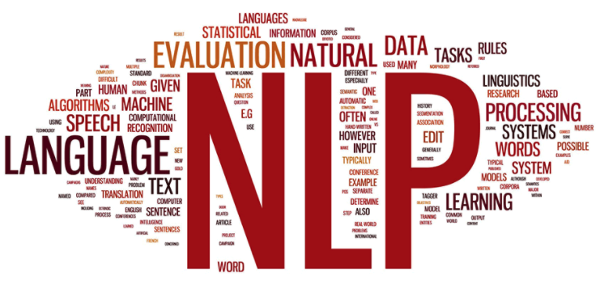
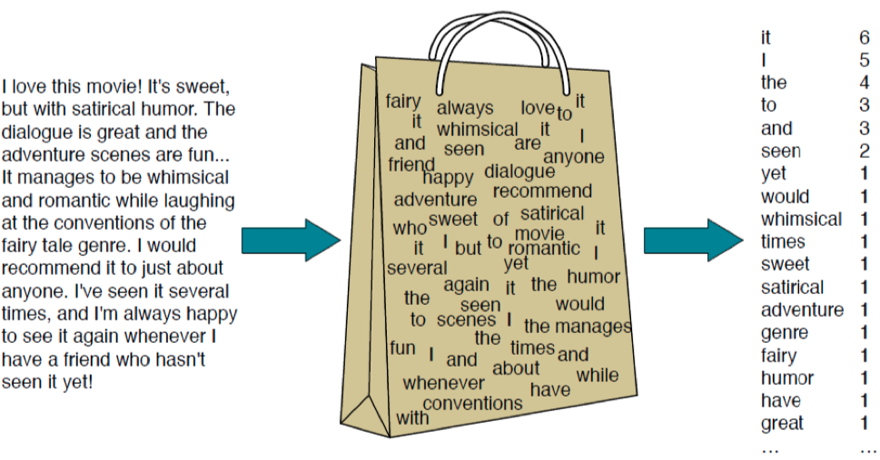

```{r setup, include=FALSE}
knitr::opts_chunk$set(echo = TRUE, eval = TRUE, warning = FALSE, message = FALSE)
suppressWarnings({
  # Add all the packages you will use in the article here
  library("rmarkdown")
  library("kableExtra")
  library("reticulate")
})
```

 on [Pexels](https://www.pexels.com/)](pexels.jpg)

## Introduction

Natural Language Processing (NLP) is rapidly gaining interest in many domains to systematically and effectively understand a large volume of text data. Especially, with the help of evolving machine learning and deep learning algorithms.
The fundamental idea of NLP in various tasks stems from effectively representing the natural language to computer-understandable format, as often called "vectorization". Effective and efficient vectorization of natural language and text lays an important foundation to conduct advanced NLP tasks, such as automated scoring, speech recognition, and natural language generation. 



In this post, we introduce different types of basic vectorization approaches that build an important foundation for various NLP tasks. More specifically, we will focus on how **term-document** matrices and the **term-frequency inverse-document frequency** matrices are constructed, as well as a quick demonstration of their importance. 

## Example Data  

In this example, we will use the data from one of the popular automated essay scoring competitions funded by the Hewlett Foundation: [Short Answer Scoring](https://www.kaggle.com/c/asap-sas). 

As a tab-separated value (TSV) file, the data set includes the following variables: 

* Id: A unique identifier for each individual student essay.
* EssaySet: 1-10, an id for each set of essays.
* Score1: The human rater's score for the answer. This is the final score for the answer and the score that you are trying to predict.
* Score2: A second human rater's score for the answer. This is provided as a measure of reliability, but had no bearing on the score the essay received.
* EssayText: The ascii text of a student's response.


In order for us to understand the data structure, we will import the data and take a look and some of the responses.

```{python chunk1, echo=TRUE, eval=TRUE}
import pandas as pd 
from pprint import pprint 

with open('train_rel_2.tsv', 'r') as f:
    lines = f.readlines()
    columns = lines[0].split('\t')
    data = []
    response_id= []
    score = []
    for line in lines[1:]:
        temp = line.split('\t')
        if temp[1] == '1':
            data.append(temp[-1])
            response_id.append(int(temp[0]))
            score.append(int(temp[2]))
        else: 
            None
         
doc = pd.DataFrame(list(zip(response_id, data, score)))
doc.columns = ['id', 'response', 'score']

print('sample response 1:')
pprint(doc.response.values[0])   
doc.head(5)
```

Each student response is associated with a score range from 0 to 3, which indicates the overall quality of the student response. For instance, score 3 indicates that the response is *"correct, complete, and contains elaborate answers with minor negligible errors"*. In order for us to grasp in-depth insights regarding what constitutes these "elaborate and complete" responses, we will focus on the semantic structure of the responses first. 
Given that the question requires a student to identify the missing information that makes the experiment replicable, we might be able to find important hints from the vocabulary and word choices to understand the overall quality of their responses. 

## Term-Document Matrix 

Term-document matrix represents texts using the frequency of terms or words that appear in the documents. While the matrix reveals the information regarding most or least dominant words across multiple texts, little to no information is preserved regarding the order of how the words appear originally in the document (**bag-of-words**). Still, the term-document matrix provides various important insights about the documents (also it is very easy to construct and to understand!)

{width=100%}

We will use *CountVectorizer* to count how many times unique vocabularies appear in each document. For analytic simplicity, we will focus on the first **five** student responses and the **top 25 vocabularies** in this demonstration. 

```{python chunk2, echo=TRUE}
from sklearn.feature_extraction.text import CountVectorizer

vect = CountVectorizer() #count vectorizaer 
vects = vect.fit_transform(doc.response)

td = pd.DataFrame(vects.todense()).iloc[:5] # Select the first five rows from the dataframe 
td.columns = vect.get_feature_names()
term_document_matrix = td.T
term_document_matrix.columns = ['Doc '+str(i) for i in range(1, 6)]
term_document_matrix['total_count'] = term_document_matrix.sum(axis=1)
term_document_matrix = term_document_matrix.sort_values(by ='total_count',ascending=False )[:25] #top 25 words 
print(term_document_matrix.drop(columns=['total_count']).head(10)) # print the first 10 rows 
```

As the name suggests, the term-document matrix has a row indicating **a list of unique vocabularies** appeared across the documents. Then, the columns represent unique document (e.g., "Doc 1", "Doc 2", .. ), in the **student responses**. Now let's take a look at which vocabularies were used most frequently across the responses. 

```{python chunk3, echo=FALSE}
term_document_matrix['total_count'].plot.bar()
```

Not surprisingly, function words (e.g., "the", "to") tended to appear more frequently than other words with more contextual information, such as the words "rock", "use". Also, this unique distribution perhaps reminds you of a very famous distribution in linguistics [Unzipping Zipf's Law](https://phys.org/news/2017-08-unzipping-zipf-law-solution-century-old.html).

### Document-Term Vector Visualization

Now that we represented each document as a unique vector that indicates information regarding word occurrence, we can visualize the relationship between the documents. This can be easily achieved by simply getting a transpose of the Term-Document matrix (so, Document-Term matrix). Let's use the two most frequent words *"the"* and *"to"* to plot the documents. 

```{python chunk4, echo=TRUE}
term_document_matrix.loc[['the', 'to']].T
term_document_matrix.drop(columns=['total_count']).T.plot.scatter(x='the', y='to')
```

It is quite difficult to understand which of the documents are highly related to each other just by looking at the relationships using two words. Now, we can plot the documents using the term vector to understand the similarities (or differences) between their word distributions of the top 25 vocabularies we selected above. 

## Cosine Similarity between Documents 

We will use cosine similarity that evaluates the similarity between the two vectors by measuring the cosine angle between the two vectors. If the two vectors are orienting the same direction, hence similar, the similarity index approaches a value close to 1. 

$$ 

similarity = cos(\theta)=\frac{\mathbf{A}.\mathbf{B}}{\|\mathbf{A}\|\|\mathbf{B}\|}=\frac{\Sigma_{i=1}^nA_iB_i}{\sqrt{\Sigma_{i=1}^nA_i^2}\sqrt{\Sigma_{i=1}^nB_i^2}}

$$
```{python chunk5, echo=TRUE}
import math
def cosine_similarity(v1,v2):
    "compute cosine similarity of v1 to v2: (v1 dot v2)/{||v1||*||v2||)"
    sumxx, sumxy, sumyy = 0, 0, 0
    for i in range(len(v1)):
        x = v1[i]; y = v2[i]
        sumxx += x*x
        sumyy += y*y
        sumxy += x*y
    return sumxy/math.sqrt(sumxx*sumyy)
```

### cosine similarity index 
Recall that each student response was associated with a score that represents the overall quality (or correctness) of the response. We could hypothesize that students might have used similar sets of vocabularies to answer the question correctly (we will see shortly!) 

```{python chunk6, echo=FALSE}
import numpy as np 

def pair(s):
    for i, v1 in enumerate(s):
        for j in range(i+1, len(s)):
            yield [v1, s[j]]
            
dic={} # saves the similarity index 
for (a,b) in  list(pair(['Doc 1', 'Doc 2', 'Doc 3', 'Doc 4', 'Doc 5'])):
  dic[(a,b)] = cosine_similarity(term_document_matrix[a].tolist(), term_document_matrix[b].tolist())

pprint(dic)

documents= ['Doc 1', 'Doc 2', 'Doc 3', 'Doc 4', 'Doc 5']
final_df = pd.DataFrame(np.asarray([[(dic[(x,y)] if (x,y) in dic else 0) for y in documents] for x in documents]))
final_df.columns =  documents
final_df.index = documents 

import matplotlib.pyplot as plt
fig, ax = plt.subplots()
ax.matshow(final_df, cmap='seismic')
for (i, j), z in np.ndenumerate(final_df):
  if z != 0 :
    ax.text(j, i, '{:0.2f}'.format(z), ha='center', va='center',
            bbox=dict(boxstyle='round', facecolor='white', edgecolor='0.3'))
  else:
    None
fig.suptitle('Cosine Similarity Index')
plt.show()
```

In the example, dataset, documents 1, 2, and 3 were given score 0, while documents 4 and 5 scored 0 and 2, respectively. 
As described in the figure, the highest similarity was found **between Document 5 and Document 1** (0.85). Unfortunately, these two documents were from different score categories. In terms of the lowest similarity, we found that Document 4 was quite different from the rest of the document with a relatively **lower cosine similarity index (0.48, 0.52, and 0.48)**. Interestingly, this document was the only one that was scored 0. 

## Conclusion and Next Step

In this post, we demonstrated how we could covert text documents (e.g., the student's written responses in a question) into a **term-document matrix**. Term-Document vectorization is often called the **"bag-of-words" representation** as it focuses on considering the frequency of words in the document to understand and preserve its semantic representations. We also attempted to understand how we could use this vectorization approach to measure the similarities between the documents. In the next post, we will focus on how we could suppress the weights of "too frequently" occurring words, such as function words (e.g., "the", "to") using different types of vectorization approach.
