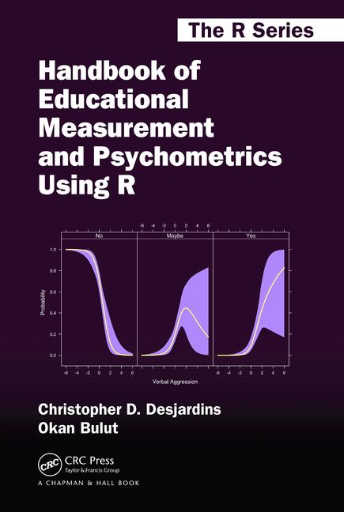

```{r setup, include=FALSE}
knitr::opts_chunk$set(echo = FALSE)
```


```{r, out.width="30%", fig.align = 'center'}

```

Welcome to the *Psychometrics and Data Science with R* blog!


My name is Okan Bulut. I am an Associate Professor in the [Measurement, Evaluation, and Data Science](https://www.ualberta.ca/educational-psychology/graduate-programs/measurement-evaluation-and-data-sciences/index.html) program at the [University of Alberta](https://www.ualberta.ca/index.html). I teach graduate and undergraduate courses on psychometrics, educational measurement, and statistical modeling. Also, I develop workshops and online courses on a variety of topics, such as data mining, big data modeling, data visualization, and statistical data analysis using R. For more information on my research and teaching activities, you can visit my personal website: [www.okanbulut.com](https://sites.google.com/ualberta.ca/okanbulut).


As a passionate R user, I conduct statistical and psychometric analysis on educational and psychological data using R. I often write my own functions but I also benefit from the existing R packages available on [CRAN](https://cran.r-project.org/), [GitHub](https://github.com/), and other platforms. In 2018, my colleague Chris Desjardins and I co-authored the [Handbook of Educational Measurement and Psychometrics Using R](https://www.routledge.com/Handbook-of-Educational-Measurement-and-Psychometrics-Using-R/Desjardins-Bulut/p/book/9781498770132). We wanted to present important topics in measurement and psychometrics as well as their applications in R. Our book comes with a complimentary package, `hemp`, that helps our readers reproduce the content presented in the book. The `hemp` package and R script files for each chapter of our book are available on GitHub: <https://github.com/cddesja/hemp>.   

```{r, out.width="30%", fig.align = 'center'}
#
```

In this blog, I hope to continue sharing psychometric applications using R. In addition, I plan to present new examples focusing on the state-of-the-art methods in data science and educational data mining. Questions, comments, and suggestions from all readers are welcomed! Lastly, if my blog has helped you, you can [buy me coffee](https://www.buymeacoffee.com/okanbulut) :-)

